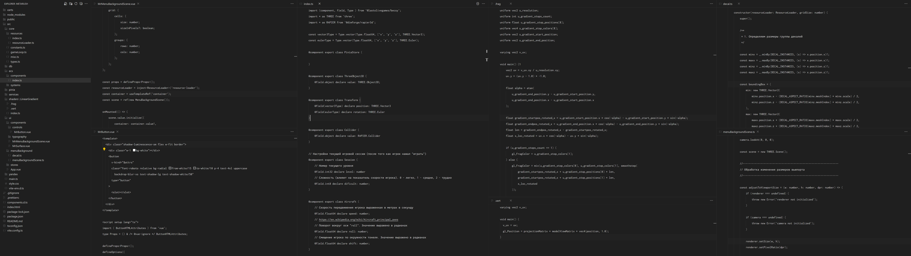
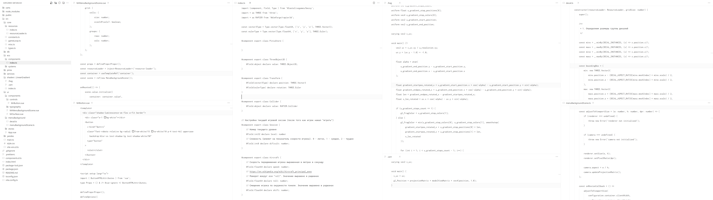

## Description

A simple monochrome theme based on “Halftone Theme”[^1], in dark and light variants for those who are tired of celebrating colors. 

Unlike the original theme all color and shape differentiation of tokens is removed because it distracts from the meaning. Would you want to read a book in which the publisher assigned different colors for each member of the sentence (predicate, nouns, verbs, adjectives, conjunctions, and so on)? I think not, and I haven't seen such books, but for some reason it is common in the programming world.

Also, the background color of all editor elements was brought to common. I couldn't see the usefulness of such things as highlighting the activity bar with a separate color. But I can feel how attention is drawn to larger elements with more “rich” colors

## Showcases





```
Font          : Inconsolata
Line height   : 2
Icons         : Quill icons
Product Icons : Fluent icons
```

[^1]: This project includes code from [halftone-theme-vsc](https://github.com/ivanesmantovich/halftone-theme-vsc), licensed under GNU GPL-3.0.